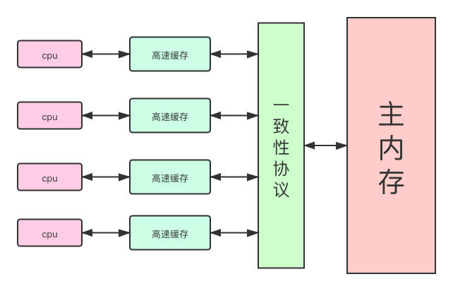
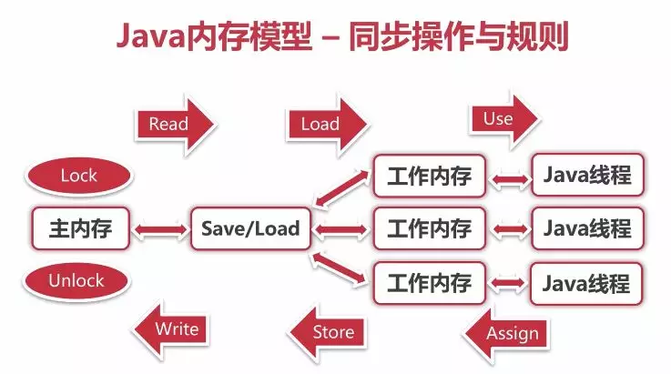

# 简述
Java虚拟机规范中试图定义一种Java内存模型（Java Memory Model，JMM）来屏蔽掉各种硬件和操作系统的内存访问差异，以实现让Java程序在各种平台下都能达到一致的内存访问效果。
# 定义模型的目标
Java内存模型的主要目标是定义程序中各个变量的访问规则，即在虚拟机中将变量存储到内存和从内存中取出变量这样的底层细节。
这里说的变量包括实例字段、静态字段和构成数组对象的元素，不包括局部变量与方法参数，因为后者是线程私有的，不会共享，也就不存在竞争的问题。
# 主内存与工作内存
ava内存模型规定了所有的变量都存储在主内存（Main Memory）中，此外每条线程还有自己的工作内存（Working Memory）。

