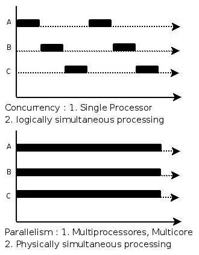
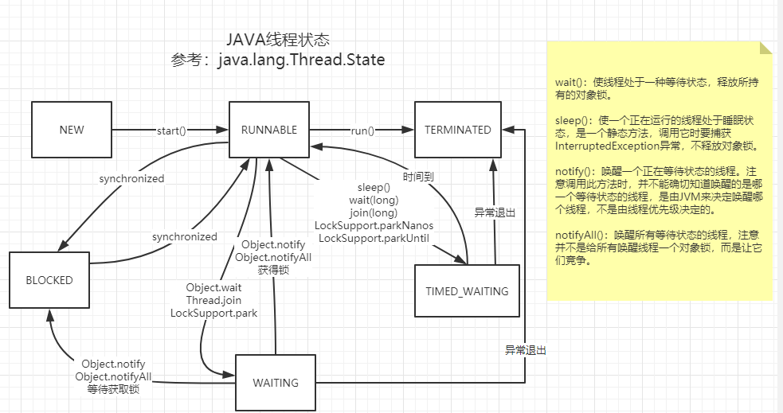

# 进程-Process
进程，是指一个正在运行的程序对于操作系统的抽象，操作系统给每一个进程分配了独立的处理器资源、内存、磁盘空间，或者网络资源。
# 线程- Thread
线程是指在一个单独进程中，对于CPU和内存而言的多个工作单位，所有线程在进程中的资源都是共享的，包括全局数据、执行代码等。
# 超线程- Hyber Threading
多核CPU的任意一个物理核，都可以通过超线程技术在极端时间内同时执行两个或多个计算任务。
# 并行- Parallelism
当系统有一个以上CPU时，当一个CPU执行一个进程时，另一个CPU可以执行另一个进程，两个进程互不抢占CPU资源，可以同时进行，这种方式我们称之为并行(Parallel)。其实决定并行的因素不是CPU的数量，而是CPU的核心数量，比如一个CPU多个核也可以并行。
# 并发-Concurrent
在操作系统中，是指一个时间段中有几个程序都处于已启动运行到运行完毕之间，且这几个程序都是在同一个处理机上运行。
# 并行-并发的差异

# java线程状态

# 多线程创建方式

# 多线程常用方法

# CountDownLatch
countDownLatch这个类使一个线程等待其他线程各自执行完毕后再执行。