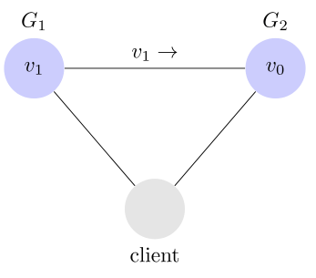

# CAP定理
  
一个分布式系统最多只能同时满足一致性（Consistency）、可用性（Availability）和分区容错性（Partition tolerance）这三项中的两项。
- Consistency 一致性，访问所有的节点得到的数据应该是一样的；
- Availability 可用性，所有的节点都保持高可用性；
- Partition tolerance 分区容忍性，这里的分区是指网络意义上的分区。由于网络是不可靠的，所有节点之间很可能出现无法通讯的情况，在节点不能通信时，要保证系统可以继续正常服务；

# C 和 A 无法同时做到的说明
一般来说，分区容错无法避免，因此可以认为 CAP 的 P 总是成立。CAP 定理告诉我们，剩下的 C 和 A 无法同时做到。
一致性和可用性，为什么不可能同时成立？答案很简单，因为可能通信失败（即出现分区容错）。  
  
如果保证 G2 的一致性，那么 G1 必须在写操作时，锁定 G2 的读操作和写操作。只有数据同步后，才能重新开放读写。锁定期间，G2 不能读写，没有可用性不。
如果保证 G2 的可用性，那么势必不能锁定 G2，所以一致性不成立。
综上所述，G2 无法同时做到一致性和可用性。系统设计时只能选择一个目标。如果追求一致性，那么无法保证所有节点的可用性；如果追求所有节点的可用性，那就没法做到一致性。

# 场景说明
**可用性高于一致性的场景**  
举例来说，发布一张网页到 CDN，多个服务器有这张网页的副本。后来发现一个错误，需要更新网页，这时只能每个服务器都更新一遍。
一般来说，网页的更新不是特别强调一致性。短时期内，一些用户拿到老版本，另一些用户拿到新版本，问题不会特别大。当然，所有人最终都会看到新版本。所以，这个场合就是可用性高于一致性。