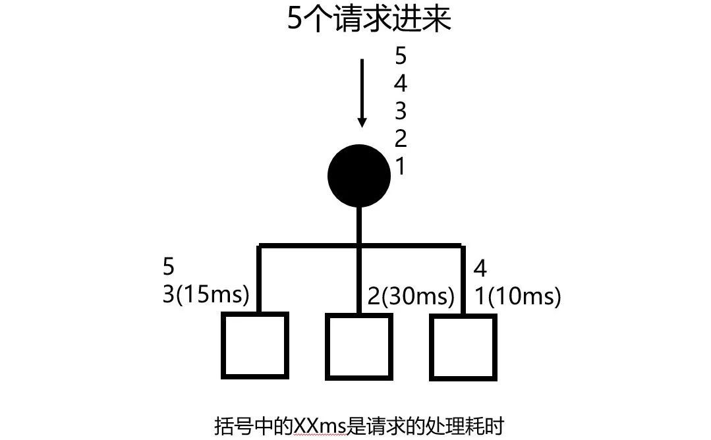

# 定义
由一个独立的统一入口来收敛流量，再做二次分发的过程就是「负载均衡」，它的本质和「分布式系统」一样，是「分治」。

# 常用负载均衡策略
* 顺序轮询
    - 最常用也最简单的策略，平均分配，人人都有、一人一次

  
* 加权轮询
    - 在轮询的基础上，增加了一个权重的概念。权重是一个泛化后的概念，可以用任意方式来体现，本质上是能者多劳的思想。

  
* 最少连接
    - 根据实时的负载情况，进行动态负载均衡的方式。维护好活动中的连接数量，然后取最小的返回即可。

  
* 最快响应
    - 根据每个节点对过去一段时间内的响应情况来分配，响应越快分配的越多。

  
* HASH法
    - 通过客户端带来的某个标识经过一个标准化的散列函数（hash函数）进行打散分摊，如取余法。

  

# 用健康探测来保障高可用
* HTTP探测，指定的URL
* TCP探测，指定的IP+端口
* UDP探测，指定的IP+端口

# 小结
将请求或者说流量，以期望的规则分摊到多个操作单元上进行执行。

# 负载均衡方案

* 客户端层
    - DNS轮询
* 反向代理层
    - nginx
* 站点层
    - 服务连接池
* 服务层
    - 数据的均衡
    - 请求的均衡
* 数据层

# 负载均衡应用
CDN的全称是Content Delivery Network，即内容分发网络。CDN的关键技术主要有内容存储和分发技术。